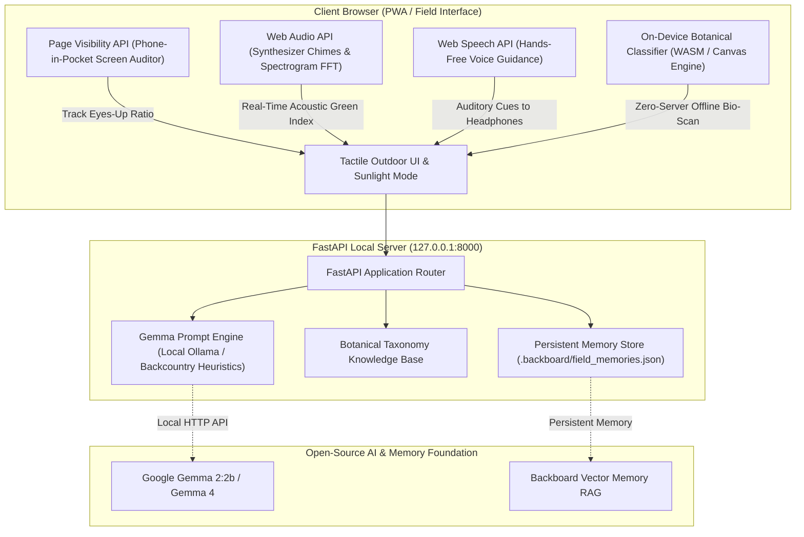

# 🌿 Groundfall: The Offline Field Naturalist & Sensory Walk Companion

> **"Build something with open-source AI at its core that gets people off the screen and into the world."**  
> *Submission for Hacktoberfest Open-Source AI Challenge Week 1: Touch Grass (`#hf26challenge`, `#devchallenge`)*

[](LICENSE)
[](https://dev.to/challenges/hacktoberfest-week1-2026-10-05)
[](https://ai.google.dev/gemma)
[](https://aditya-prog-bit.github.io/groundfall/)

---

### 🌐 Live Interactive Demo
👉 **[https://aditya-prog-bit.github.io/groundfall/](https://aditya-prog-bit.github.io/groundfall/)**  
*Anyone can open and test Groundfall immediately on any device (phone or desktop) with zero installation, zero server required, and 100% on-device client privacy.*

---

## 🍂 Why Groundfall?

Most "outdoor" apps do the exact wrong thing: they ask you to look at a screen while you're standing in front of an ancient oak tree. They flash notifications, show turn-by-turn map lines, and track gamified streaks that keep your gaze glued to glass.

**Groundfall is built on the inverse principle: Make the screen the shortest part of the experience.**

Before you step outside, **Gemma** crafts a tailored sequence of tactile, acoustic, and botanical micro-cues spaced across your chosen walk duration. You tuck your phone into your pocket and head outside. Through soft harmonized trail bell chimes and headphones, Groundfall guides your senses—encouraging you to touch bark, track wind friction through pine needles, and listen for avian calls—while actively penalizing you if you take your phone out.

---

## 🏗️ System Architecture



---

## ✨ Core Features

### 1. 👁️ Eyes-Up Screen-Time Auditor
Groundfall uses the HTML5 **Page Visibility API** (`document.visibilityState`) to measure how much time your screen was actually locked/hidden in your pocket versus active in your hand:
- **Eyes-Up Ratio**: Real-time score calculating `% of walk spent looking at the world`.
- **Screen Glance Counter**: Detects every time you pull the phone out of your pocket.

### 2. 🧠 Gemma-Powered Sensory Drift Planner
Generates dynamic observation prompts tailored to autumn biomes:
- **🍁 Autumn Foliage & Canopy**: Leaf chlorosis, sunlight dappling, and vertical bark fissures.
- **🐦 Bio-Acoustic Listening**: High-frequency avian chatter (2–8 kHz) and wind resonance.
- **🍄 Micro-Biome & Soil Grounding**: Moss colonies, lichen geometries, and geosmin scents.
- **🏃 Sensory Run & Stride**: Horizon fixation, footstrike pacing, and outdoor breath intervals.

### 3. 🔔 Gentle Auditory Guidance (Zero Screen Glancing)
Using the browser's native **Web Audio API**, Groundfall synthesizes dual-tone singing bowl trail bells (587 Hz D5 & 880 Hz A5) directly in memory with zero external audio assets, followed by calm text-to-speech audio guidance.

### 4. 🌿 Real-Time Bio-Acoustic Spectrogram Meter
Monitors ambient frequency bands using the Web Audio FFT Analyzer:
- Identifies natural high-frequency bands (birds, rustling dry foliage) vs. low-frequency urban rumble (<500 Hz).
- Computes an live **Acoustic Green Index** to guide walkers toward quiet natural havens.

### 5. 🔍 100% Offline Botanical Scanner
Encounter a mysterious specimen in the backcountry? Groundfall's on-device morphology classifier identifies common autumn trees, mosses, and fungi (Maples, Oaks, White Pine, Paper Birch, Velvet Moss, Turkey Tail Polypore) and serves seasonal ecology context—with **zero cloud requests**.

### 6. 📖 Naturalist Field Notebook & Backboard Memory
Upon returning, speak or type what you noticed. Gemma synthesizes your raw telemetry and debrief into a field journal entry, earns you a botanical specimen badge, and archives it to `.backboard/field_memories.json` for persistent seasonal memory.

---

## 🌍 Why Open Innovation Matters

1. **Backcountry Isolation**: Mountain trails and remote forests have zero cellular reception. Closed cloud APIs break the moment you lose signal. Open-weight models (Gemma) and on-device Web APIs work everywhere on earth.
2. **Total Location & Voice Privacy**: Your GPS trails, nature photographs, and personal voice debriefs never touch corporate servers. Your natural encounters belong to you.
3. **Zero Inference Cost**: Groundfall is 100% free to run forever—no credit cards, tokens, or monthly subscriptions just to step outside.

---

## 🚀 Quick Start

### Prerequisites
- Python 3.10+ (FastAPI and Uvicorn)
- Any modern web browser (Chrome, Edge, Firefox, Safari)

### Run with One Click
Double-click `run_groundfall.bat` (or run `run_groundfall.ps1` in PowerShell).

Or start manually via terminal:
```bash
python -m uvicorn app:app --host 127.0.0.1 --port 8000 --reload
```

Then visit:
```
http://127.0.0.1:8000
```

### Running Unit Tests
```bash
python -m unittest test_groundfall.py
```

---

## 🏆 Hacktoberfest Prize Tracks
- **Featured Category**: *Best Use of Gemma* (Gemma powers the prompt generation and naturalist debrief synthesis)
- **Partner Category**: *Best Use of Backboard* (Backboard vector memory storage format for field logs)

---

## 📄 License
MIT License. Created for Hacktoberfest 2026.
